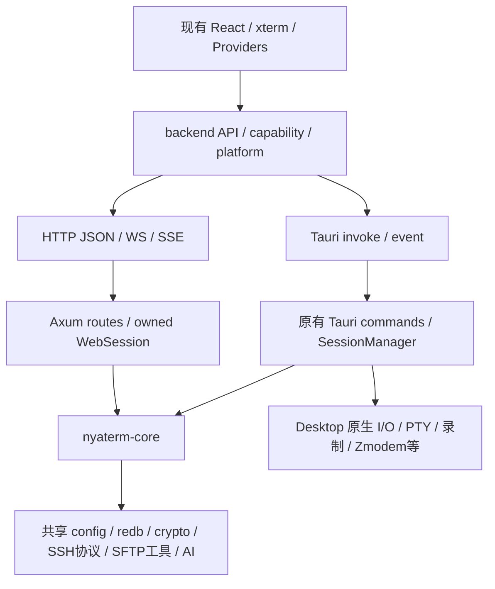

# Web / Desktop 实现与验收报告

## 源码审查与边界

实际入口为 `src/main.tsx`，主窗口复用 `AppProvider`、`PluginProvider` 和 `App.tsx`，子页面复用 `ChildAppProvider` / `ChildWindowRouter`。原来的 `src/lib/invoke.ts` 是主要业务调用入口，但会话工厂、日志、事件、窗口、文件和设置代码也存在直接 Tauri 调用。本次将这些调用转到 `src/lib/backend`；没有新增第二套 React 应用或替换现有 workspace/state 模型。

Desktop 的 `cmd/session.rs` 在进入 `core/ssh/session.rs` 前处理连接解析、认证提示、录制和 ownership。`core/ssh/{client,auth,io}.rs` 包含 Tauri state/event 依赖，以及 OSC、录制、Zmodem、命令捕获等原生逻辑，继续留在 Desktop。SFTP 使用同一 russh 连接和 vendored russh-sftp。配置/存储/加密中的 AppHandle 原来主要是接口参数，适合抽到共享库。AI provider、模型选择、流式解析、prompt/redaction/history 同样抽到共享库；Desktop 的 Agent 执行、审批和原生集成保留。

参考了 `temp/dbx/crates/dbx-web` 的 Core/HTTP/SSE/静态资源分离、限额和 base path 设计；没有复制 DBX 源码或引入其依赖。

## 已实现架构

Core 和 Web 是两个独立 Cargo crate；Desktop 以 path dependency 引用 Core。没有把 vendored russh 纳入新的顶层 workspace，避免其已有 workspace dependency 解析冲突。

共享范围包括配置类型与迁移、redb 文档、AES-GCM/主密码密钥层次、历史工具、SSH 算法/连接/密码和交互认证/通道回复/输入/resize、Telnet 协商/自动登录/行编辑/字符编解码、共享 TCP 代理、VNC 协议运行器/帧缓冲/帧编码、SFTP 初始化及原有文件属性/文本冲突工具、私钥校验和公钥派生、AI provider/model/catalog/prompt/redaction/parser/stream/history。Web 专属的会话 ownership、cookie、认证提示、HTTP 文件流和生命周期留在 Web crate。Desktop 和 Web 的会话调度循环不同，因为 Desktop 仍提供原生附加能力；没有复制原生 SSH/SFTP 全栈。

## 新增与修改文件

| 文件/目录                                                                                          | 实际作用                                                                                       |
| -------------------------------------------------------------------------------------------------- | ---------------------------------------------------------------------------------------------- |
| `src/lib/backend/{api,tauri,http,runtime,events}.ts`                                               | 同类型 invoke/listen/emit，运行时选择、集中能力、同源 URL、WS 和 SSE。                         |
| `src/lib/backend/platform/{app,window,webviewWindow,webview,path,dialog,opener}.ts`                | Desktop 转发原 API；浏览器替代或拒绝原生操作。                                                 |
| `src/lib/backend/{BrowserGate.tsx,files.ts,web.test.tsx}`                                          | 登录入口、浏览器 File 上传/下载和边界测试。                                                    |
| `src/main.tsx`、`src/lib/{invoke,windowManager,appSessionFactory,appWorkspace,...}`                | 接入边界，复用现有页面、状态和子窗口流程。                                                     |
| 现有 providers/hooks、terminal/SFTP/AI/设置/连接/插件组件                                          | 替换原生 imports，依据集中 capability 隐藏/禁用能力。四种 locale 增加 Web 登录文本。           |
| `src-tauri/crates/nyaterm-core/src/{config,storage,utils,core/ai,core/history,ssh,services.rs}`    | 从原有文件移动共享逻辑，新增通用协议与服务边界。                                               |
| `src-tauri/src/{config,storage,utils,core/ai,core/history,core/sftp/util.rs,...}`                  | 原位置使用 re-export/wrapper，保留 Desktop 调用兼容性。文件删除对应迁入 Core，非删除桌面功能。 |
| `src-tauri/src/{cmd/connection.rs,cmd/ai.rs,core/ssh,core/sftp/sftp_backend/session.rs}`           | 调用共享服务与协议；原生管理器继续保留。                                                       |
| `src-tauri/crates/nyaterm-web/src/{main,lib,auth,state,session,commands,sftp,ai,plugins,error}.rs` | 独立服务、显式命令 allowlist、会话和资源清理。                                                 |
| `src-tauri/crates/nyaterm-web/tests/{transport,bootstrap,protocols}.rs`                            | 真实 SSH/SFTP、Telnet、VNC、代理/跳板 fixture 与进程启动测试。                                 |
| 各 crate Cargo.toml/Cargo.lock、`package.json`、`vite.config.ts`                                   | 依赖、构建入口和 base path。                                                                   |
| `Dockerfile`、`.dockerignore`、`docker-compose.yml`、`.gitignore`                                  | 三阶段非 root 容器、持久 volume、构建上下文/秘密排除。                                         |
| `docs/web-deployment.md`、本文                                                                     | 操作步骤、能力、安全边界和验证报告。                                                           |

原生 imports 只在 transport/platform 边界及被 capability 隔离的 RDP Channel 和桌面 VNC Channel 适配器、updater 和 native PluginPanel 资源转换中保留。不会在 Web startup 创建原生 Channel 或加载原生插件。

## 调用链

**Desktop terminal**：现有会话工厂 → typed invoke → Tauri adapter → `cmd/session.rs` → 原 SessionManager/SSH session → 共享 protocol/algorithm/input/resize → 原生 I/O loop → Tauri output event → 原 XTerminal。

**Web terminal**：同一会话工厂 → HTTP adapter → `POST /api/sessions` → WebSession + Core protocol/russh → `WS /api/sessions/{id}/terminal` → 二进制输出 / JSON 或二进制输入 / JSON resize/control → 同一 XTerminal。SSH host-key/password/passphrase/keyboard-interactive 提示通过 owner 的 SSE 到现有对话框，HTTP 响应按 requestId 返回。

**SFTP**：同一 FileExplorer → HTTP command → owner session 检查 → 同一 russh handle 的 SFTP subsystem → 共享初始化/文件工具。上传使用浏览器 File 作为原始流式 request body，远端同目录 `.part` 成功后 rename；下载使用 HTTP body stream 和 Content-Disposition/Content-Length。进度通过 SSE 的现有 transfer-event 格式送入 TransferContext。Desktop 继续使用本地 picker/path/拖拽、原有原生传输管理器。

**AI**：同一 AI panel → HTTP command → Web Ask/ownership/强制 redaction → Core model/provider/stream → owner SSE → panel。模型发现、测试、历史、清除/重绑共享 Core。Agent/MCP/原生附件在 Web 拒绝。

**设置与凭据**：HTTP allowlist / Tauri commands → shared config/services → redb/AES-GCM；Web 显式 secret getters 仅供已认证管理员主动读取，列表不返回明文。Web 会合并 masked AI/settings 字段，并拒绝通过 settings save 关闭或替换现有主密码。

## 生命周期与资源上限

1. 先建立 SSE，再创建 SSH、Telnet 或 VNC；创建立即返回不透明 ID，后台连接有 120 秒总超时，提示有 90 秒超时。
2. 每个登录最多 16 个会话、4 个 AI 请求；全局最多 128 个会话和 128 个登录；每个 session 最多 4 个 SFTP 操作。
3. 每个会话最多一个 WS attachment；SSH/Telnet output queue 为 32 × 64 KiB（2 MiB），WS write buffer 最多 256 KiB。输出按序 backpressure，最终 close 在 final bytes 后；socket send 有超时。输入 queue 为 128 条、WS 单帧/消息最大 64 KiB，浏览器发送缓冲超过 1 MiB 拒绝继续输入。
4. WS 每 15 秒 heartbeat，45 秒没有 peer 活动断开。断线保留 30 秒 attachment lease 和有界输出；浏览器自动尝试同 session 重附着，明确 SSH/Telnet reconnect 则创建新连接，VNC reconnect 沿用已有 ID。lease 到期取消连接。
5. 显式 close、创建取消、logout、8 小时登录到期和 shutdown 通过 CancellationToken 终止等待、SSH、SFTP 和 AI。SSH disconnect 有超时，registry 清除后发 session change。
6. 上传中断/失败或响应被丢弃时，RAII cleanup 清除 `.part` 并关闭 SFTP；上传/下载和文件操作均受 owner 与 cancel 约束。Web 无传输暂停/重试服务。
7. SIGTERM/Ctrl-C 取消共享 shutdown，HTTP graceful drain 最多 5 秒，再等待会话清理最多 5 秒。重启不会恢复活跃网络连接。

## 能力矩阵

| 能力                                                                      | Web MVP                                                                                           |
| ------------------------------------------------------------------------- | ------------------------------------------------------------------------------------------------- |
| 保存/临时 SSH、终端输入输出/resize/关闭                                   | 支持标准 profile，UTF-8；应用终端类型，解析全局编码。                                             |
| 密码/私钥、主机指纹与手工交互认证                                         | 支持；不绕过 known_hosts；可提示私钥 passphrase。                                                 |
| 保存连接/组、基础凭据、设置                                               | 共享持久化。保存数据为实例共享；活动会话按登录隔离。                                              |
| SFTP 浏览、单文件上传/下载、文本编辑                                      | 流式传输；应用 enabled/pipeline depth；UTF-8 文件名；不支持 compatibility mode/递归或原生工作流。 |
| AI Assistant                                                              | provider API/Ask streaming、脱敏、历史；无 Agent、MCP 或本地附件。                                |
| 插件                                                                      | Web target/capability/permission 检查框架；只允许 UI 类权限，未提供安装或执行器。                 |
| 本地文件、剪贴板、外部链接、子窗口                                        | 浏览器 File/download、Clipboard、受限链接、同源 iframe 页面替代；浏览器权限仍适用。               |
| Local Shell/PTY、Serial、RDP                                              | 不支持；创建入口与服务均 gate。                                                                   |
| tray、原生窗口、全局快捷键、桌面通知、OS credential manager、自动更新     | 不支持；Web 采用服务端加密存储和浏览器页面。                                                      |
| SCP/Zmodem、watcher、复杂本地文件集成、录制、远程监控、传输控制、同步备份 | 不支持，集中 capability/panel/settings gate。                                                     |
| SSH agent/X11/证书、SSH 启动命令、network_device、非 UTF-8 SSH            | 拒绝连接；不能静默改成直接连接或忽略这些配置。                                                    |
| OSC/CWD 自动跟踪、动态标题                                                | Web 暂不提供；Desktop 原逻辑保留。                                                                |

补充能力：Telnet/VNC 使用独立 capability，启用 VNC 不会启用 RDP。Telnet 复用 terminal WebSocket，将字符串输入按连接编码转换，二进制输入保留原始字节；服务端输出统一转成 UTF-8。VNC 使用 `/api/sessions/{id}/vnc`：二进制帧与桌面共用 44 字节补丁头，JSON 承载状态、输入和剪贴板。附着时重放完整画面与状态，最多缓存两帧，溢出后从权威帧缓冲重同步，完整帧和增量帧有序发送。只读限制在服务端执行。

`POST /api/sessions` 的 `type` 可为 `ssh`、`telnet`、`vnc`，省略时仍为 SSH。共同注册、数量限制、登录归属、取消、注销及关停清理位于 Web 会话层；SFTP 拒绝非 SSH 会话。代理 CRUD 沿用原有 redb 与凭据加密规则。共享 TCP 支持 SOCKS5/HTTP CONNECT，Web SSH `direct-tcpip` 支持递归跳板、自身代理、循环检查和 8 层限制，凭据不出现在 URL。刷新利用现有持久 pane ID 匹配同登录的会话租期，无需数据迁移。

## 安全边界

这是单管理员实例，不是多租户 ACL 服务。共享保存配置和历史应只对可信管理员开放。高熵登录密码与独立 32 字节外部数据密钥必须配置；启动不能回退到 OS credential manager 或路径派生密钥。既有主密码层次保留，错误数据密钥启动失败。redb 的元数据/AI 历史不等于整个数据库加密。

cookie 为随机 256 bit、HttpOnly、SameSite=Strict，HTTPS 下 Secure，Path 绑定 base path，8 小时有效。登录校验 Origin 与自定义请求头；mutation 校验 CSRF；WS 校验 cookie 和 Origin；所有静态/API/事件/传输入口校验配置的 Host 与存在的 Origin。没有 wildcard CORS，也不把 forwarded headers 当作认证依据。非回环 public URL 默认要求 HTTPS；可通过 `NYATERM_WEB_ALLOW_INSECURE_HTTP=true` 显式允许 HTTP，Host/Origin 校验仍保持不变。前端请求 ID 在没有 `crypto.randomUUID` 的 HTTP 环境使用 `crypto.getRandomValues` 生成 UUID v4。登录尝试限额为全局每分钟 20 次。

session/prompt/AI cancellation 隔离于登录 owner，跨 owner 的 session 返回 404、prompt 返回 403。WS URL 不含 token。SSH unknown/changed key 均要求明确确认后才保存。secret 不进入日志/列表，响应使用 no-store，并设置 CSP/nosniff/referrer policy。Web command 显式 allowlist，不能反射调用任意 Tauri command、访问服务端任意本地路径或执行本地程序。浏览器插件框架不提供服务端文件/进程权限。

## 历史验证结果

已完成的验证：

- 共享 Core：292 个单元测试通过，覆盖原有配置、迁移、存储、加密、SFTP helper、AI provider/catalog。
- 前端全量：158 个文件、1003 个测试通过；Web adapter 测试覆盖同源/base URL、CSRF、UTF-8 WS/输入/resize、native 拒绝、有界发送、既有设置 iframe 和登录 gate。
- Web integration：真实 russh fixture、SFTP subsystem、mock OpenAI-compatible provider；认证/CSRF/Host/CSP/SPA、owner prompts、known-host 首次确认及变更拒绝、UTF-8 input/resize、断开重附着、3 MiB 输出及 final-tail、5 MiB 上传下载、上传中断清理、凭据加密、AI stream/redaction/history、错误加密密钥拒绝。
- Desktop `cargo check --locked` 通过。原生 Rust 测试已成功编译，但测试 exe 在运行前以 `0xc0000139` / `STATUS_ENTRYPOINT_NOT_FOUND` 退出，无法验证 Desktop 原生 SSH/SFTP 运行测试；共享部分已由 Core 和 Web 测试验证。

- Web 进程启动测试通过：外部 `_FILE` 秘密、真实 HTTP 登录/API、子路径首页，以及更换数据密钥后拒绝重启。Axum 子路由使用带 `/` 的挂载点，裸路径重定向到目录 URL。
- 追加的 Web 安全/兼容断言通过：跨 owner / 错 Origin 的 WS upgrade 拒绝、全局编码、保存连接的加密认证、SFTP disabled、AI target-context ownership/redaction、清除历史、HTTP logout，以及等待 host-key prompt 时取消创建后的 session/prompt 清理。
- TypeScript、`pnpm lint`、Rust formatting、Desktop `cargo check --lib --locked` 通过。lint 保留未修改 CommandSuggestions 中一个既有 dependency warning；Vite 有既有 chunk-size/Browserslist 提示。
- `pnpm build` 和 `/nyaterm/` base path 的 `pnpm build:web` 已通过；输出资源和图标使用构建 base path；最后一轮两种构建均通过。

本机未安装 Docker CLI，未执行 Docker image build、Linux 容器运行和浏览器视觉/手工交互验收；不能把 HTTP fixture/DOM 测试称为这些验证。部署步骤见 [web-deployment.md](web-deployment.md)。

## 后续扩展

现已加入只读 Web 合并 CI、三平台桌面编译及 Docker/OpenSSH/Playwright 双路径验收脚本；本机未执行 Docker，实际通过情况须等待 CI，见 [合并准备报告](web-merge-readiness.md)。再把更多 SSH auth/session policy 抽为注入 event sink 的服务，减少两端调度差异。随后实现更细的能力描述与本地化不可用提示、Web 插件 sandbox/runtime、SFTP 递归/完整任务取消控制、OSC/CWD。若需要多人使用，先增加用户、保存资源 ACL、AI history 隔离和审计，再放开多用户入口。

## Telnet / VNC 增量验证

- 新增 `nyaterm-web/tests/protocols.rs` 使用本地 TCP/RFB/代理/SSH jump fixture，覆盖保存与临时配置、GBK、原始字节、自动登录后的启动延迟、NAWS、本地行编辑、SOCKS5/HTTP 有认证及无认证连接、嵌套跳板、自身代理、路由优先级、循环、代理配置与解密失败，及 VNC 完整/增量帧、尺寸变化、键鼠、只读、剪贴板、重连、刷新重附着、跨登录隔离与注销清理。
- Core 包含抽取后的 Telnet/编码/VNC 原有测试，以及分片 IAC、NAWS 转义和慢订阅者完整帧重同步测试。
- Core 292 项、vendored VNC 协议库 40 项测试通过。Web 三项集成测试通过；Telnet/VNC/代理/生命周期集成测试连续 10 次通过，覆盖终端结束前最后输出的送达。
- 前端全量 158 文件、1003 项测试通过；Web 构建、lint 和四语言格式检查通过，桌面 `cargo check --locked` 通过。Docker CLI 当前不可用，容器实构建及真实远端图形环境手工验收仍待部署环境执行。

## Web Beta 可靠性增量

浏览器 SSH/Telnet 由 `BrowserTerminals` 持有每会话连接状态，初次握手和掉线恢复统一执行有时间预算的附着重试，复用 `get_session_info` 查询和原有终端事件，无新增重连协议。跨 WS/SSE 的关闭事件只投递一次。

Web 上传使用 SFTP lstat 区分存在、目录、权限和连接错误，复用 owner 冲突提示。临时文件和传输许可由 RAII guard 持有直到异步清理结束，显式会话关闭等待清理后才断开 SSH；提示 future 被 HTTP 中断丢弃时仍会移除待响应记录。数据格式保持兼容，新增响应字段见部署文档。
